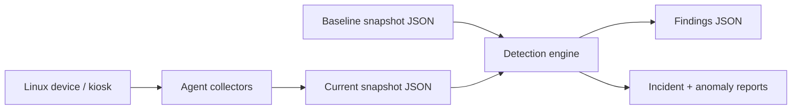
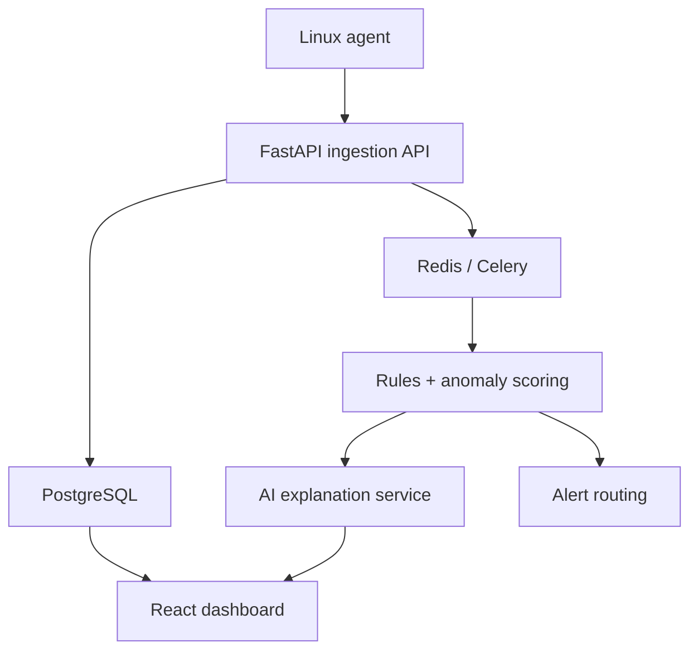

# GhostWire Sentinel Architecture

GhostWire Sentinel is currently a dependency-free Python CLI MVP. The product direction is a lightweight endpoint threat hunting platform for Linux devices, kiosks, signage players, and remote edge infrastructure.

## Current MVP Flow

## Agent Modules

- `agent.collectors.processes` captures running process metadata from `ps`.
- `agent.collectors.services` captures systemd service names and enablement state.
- `agent.collectors.cron` captures system and user cron entries.
- `agent.collectors.ssh_keys` captures authorized key metadata without storing full keys.
- `agent.collectors.connections` captures outbound connection metadata from `ss` or `netstat`.

## Detection Modules

- `baseline.compare` identifies drift from an approved snapshot.
- `detectors.anomaly` turns baseline drift into findings.
- `detectors.persistence` detects suspicious cron, service, and process patterns.
- `detectors.beaconing` detects suspicious remote ports and repeated outbound destinations.
- `report` generates human-readable incident and anomaly reports.

## Future Product Architecture

The MVP intentionally keeps detection local and deterministic. The backend, dashboard, and AI explanation layer should be added only after the CLI workflow is stable and well tested.
